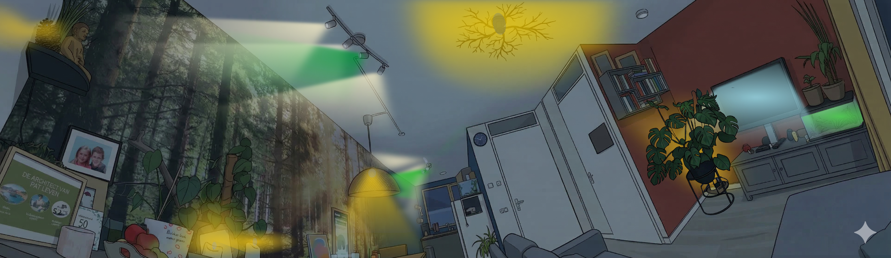

# HA Interactive Floorplan



[![HACS][hacs-badge]][hacs-url]
[![GitHub Release][release-badge]][release-url]
[![License][license-badge]][license-url]

**[🚀 Live Demo](https://padraiggg.github.io/Padraigggs-ha-interactive-floorplan/demo/)** — try it without Home Assistant!

A powerful, interactive floorplan visualization for [Home Assistant](https://www.home-assistant.io/) — **two Lovelace cards** that work together:

| Card | Purpose |
|------|---------|
| `custom:ha-floorplan-card` | **Viewer** — interactive floorplan with clickable lights, cameras, switches |
| `custom:ha-floorplan-editor` | **Editor** — visual drag & drop editor that pushes config directly to HA |

Upload a photo of your home, place entities on it with the editor, push to your dashboard, and control everything with a single click — lights glow with their real RGB color, cameras blink when recording, and switches toggle instantly.

**No external servers, no tokens, no YAML editing.** The editor runs as a native Lovelace card with full access to your Home Assistant instance.

## ✨ Features

### Viewer Card (`custom:ha-floorplan-card`)
- **Click to toggle** lights, switches, and media players directly from your floorplan
- **Long press** any entity to open the Home Assistant more-info dialog
- **Real-time RGB color** — lights render their actual color and brightness from HA
- **Camera states** with separate colors for idle, streaming, and recording
- **Recording blink animation** — cameras blink when in recording state
- **Overlay images** — decorative elements (plants, furniture) layered on the floorplan
- **Edge blur** — configurable Gaussian blur for softer, more realistic light gradients
- **Smart domain detection** — detects real entity domain from entity ID, preventing service call mismatches (e.g. `switch.*` entities configured as `light` type)
- **Polygon light zones** — custom polygon shapes for realistic light spread
- **Clickable polygons** — the entire light zone is clickable, not just the entity dot
- **Container query responsive** — labels scale with card size using `cqw` units

### Editor Card (`custom:ha-floorplan-editor`)
- **Drag & drop** entity placement on your floorplan image
- **Draw polygon zones** — click to add vertices, drag vertices to reshape
- **Properties panel** — configure entity type, colors, blur, shape, labels, and more
- **Live preview** — toggle entity states to see how they look
- **📥 Load from HA** — automatically loads the current floorplan config from your dashboard
- **📤 Push to HA** — one-click push saves your changes directly to the dashboard (via WebSocket, no external server needed)
- **Export/Import YAML** — backup and restore configs as YAML files
- **Image upload** via drag & drop or file picker
- **Zoom controls** for precise editing

## 📦 Installation

> ⚠️ **Choose ONE method only — HACS _or_ Manual. You do not need both.**

### Option A: HACS (Recommended)
1. Open **HACS** in Home Assistant
2. Go to **Frontend** → **⋮** → **Custom repositories**
3. Add this repository URL with category **Lovelace**
4. Search for **"HA Floorplan Card"** and install
5. Restart Home Assistant

> HACS installs `ha-floorplan-card.js` which includes both the viewer and editor — no further steps needed.

### Option B: Manual Installation
1. Download `ha-floorplan-card.js` from the [latest release][release-url]
2. Copy the file to `/config/www/`
3. Go to **Settings** → **Dashboards** → **⋮** → **Resources**
4. Add `/local/ha-floorplan-card.js` as a **JavaScript Module**

> This single file contains both the viewer card and the editor card.

## 🎨 Setup

### Step 1 — Add the cards to a dashboard

The recommended setup uses a tabbed layout so you have the Viewer and Editor side by side. This example uses [`custom:tabbed-card`](https://github.com/kinghat/tabbed-card) (install via HACS):

```yaml
type: custom:tabbed-card
tabs:
  - attributes:
      label: View
    card:
      type: custom:ha-floorplan-card
      config:
        id: my-floorplan
        name: Home
        imageBase64: ""
        entities: []
  - attributes:
      label: Editor
    card:
      type: custom:ha-floorplan-editor
      dashboard: lovelace
```

> 💡 Save this to a dashboard first before opening the editor — the editor needs an existing floorplan card to load from and push to.

### Step 2 — Configure the Editor Card

| Option | Type | Default | Description |
|--------|------|---------|-------------|
| `dashboard` | string | `lovelace` | The URL path of the dashboard where your floorplan card lives |
| `card_index` | number | *(auto)* | Specific card index to edit (if you have multiple floorplan cards) |

#### How to find your dashboard URL path

The `dashboard` value is the **last part of your dashboard's URL**:

| Dashboard URL in browser | `dashboard` value to use |
|--------------------------|--------------------------|
| `http://homeassistant.local:8123/lovelace/0` | `lovelace` |
| `http://homeassistant.local:8123/lovelace/floorplan` | `lovelace/floorplan` |
| `http://homeassistant.local:8123/my-custom-dashboard` | `my-custom-dashboard` |

For most users the default value `lovelace` is correct.

### Step 3 — Use the editor

1. Open the dashboard where you added both cards
2. Switch to the **Editor** tab
3. Upload your floorplan image (drag & drop or click)
4. Add entities and position them on the image
5. Draw polygon light zones for each entity
6. Configure colors, brightness, blur, and labels
7. Click **📤 Push to HA** to save
8. Switch to the **View** tab — your interactive floorplan is live!

### Standalone Cards

You can also use the cards independently:

**Viewer only:**
```yaml
type: custom:ha-floorplan-card
config:
  id: my-floorplan
  name: Home
  imageBase64: data:image/jpeg;base64,...
  entities:
    - id: living-room-light
      entityId: light.living_room
      label: Living Room
      type: light
      x: 45
      y: 60
      shape: circle
      style:
        width: 5
        height: 5
        gradientRadius: 30
        edgeBlur: 0.5
        onOpacity: 0.8
        offOpacity: 0.3
        colors:
          onColor: "#facc15"
          offColor: "#94a3b8"
      points:
        - { x: 30, y: 50 }
        - { x: 60, y: 50 }
        - { x: 60, y: 80 }
        - { x: 30, y: 80 }
      labelConfig:
        show: true
        offsetX: 0
        offsetY: 10
        color: "#ffffff"
```

**Editor only:**
```yaml
type: custom:ha-floorplan-editor
dashboard: my-dashboard
```

## 🛠️ Development

```bash
# Install dependencies
npm install

# Run the standalone editor in dev mode (with Viewer/Editor tabs)
npm run dev

# Build the combined HA card (viewer + editor) → release/ha-floorplan-card.js
npm run build:combined

# Build cards separately (for development)
npm run build:card     # viewer only → release/ha-floorplan-card.js
npm run build:editor   # editor only → release/ha-floorplan-editor.js
```

## 📄 Configuration Reference

### Entity Style Options

| Property | Type | Default | Description |
|----------|------|---------|-------------|
| `width` | number | `5` | Entity dot width (%) |
| `height` | number | `5` | Entity dot height (%) |
| `gradientRadius` | number | `30` | Light spread radius (%) |
| `edgeBlur` | number | `0` | Gaussian blur for softer light edges |
| `onOpacity` | number | `0.8` | Opacity when entity is on |
| `offOpacity` | number | `0.3` | Opacity when entity is off |
| `rotation` | number | `0` | Rotation in degrees |
| `colors` | object | — | On/off colors (light/switch) or idle/recording/streaming (camera) |

### Entity Types

| Type | Service | Behavior |
|------|---------|----------|
| `light` | `light.toggle` | Renders RGB color + brightness from HA state |
| `switch` | `switch.toggle` | Simple on/off with configurable colors |
| `media_player` | `media_player.toggle` | Highlights when playing/paused |
| `camera` | `homeassistant.toggle` | Idle/streaming/recording with blink animation |

### Overlay Images

| Property | Type | Description |
|----------|------|-------------|
| `src` | string | Image URL or base64 data URI |
| `x` | number | Horizontal position (%) |
| `y` | number | Vertical position (%) |
| `width` | number | Width (%) |
| `height` | number | Height (%) |
| `rotation` | number | Rotation in degrees |
| `opacity` | number | Opacity (0-1) |

## 🤝 Credits

Based on [ha-floorplan](https://github.com/kishorviswanathan/ha-floorplan) by [@kishorviswanathan](https://github.com/kishorviswanathan), with significant additions:
- **Editor as Lovelace card** — edit directly inside HA, push via WebSocket
- **Overlay images** — decorative image layers on top of the floorplan
- **Edge blur** — SVG Gaussian blur for softer light gradients
- **Smart domain detection** — prevents service call mismatches for cross-domain entities
- **Clickable polygon zones** — entire light zones are clickable, not just entity dots
- **Switch entity support** — first-class switch type with proper toggle service

## 📝 License

[MIT](LICENSE)

---

## ☕ Support My Work

If you enjoy this project and want to support further development, any contribution is greatly appreciated!

[](https://paypal.me/PatrickWolvers)
[](https://patreon.com/Padraiggg)

[hacs-badge]: https://img.shields.io/badge/HACS-Custom-orange.svg
[hacs-url]: https://hacs.xyz
[release-badge]: https://img.shields.io/github/v/release/Padraiggg/Padraigggs-ha-interactive-floorplan
[release-url]: https://github.com/Padraiggg/Padraigggs-ha-interactive-floorplan/releases/latest
[license-badge]: https://img.shields.io/github/license/Padraiggg/Padraigggs-ha-interactive-floorplan
[license-url]: https://github.com/Padraiggg/Padraigggs-ha-interactive-floorplan/blob/main/LICENSE
